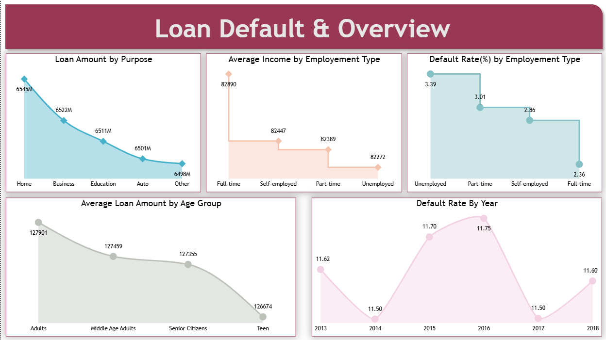
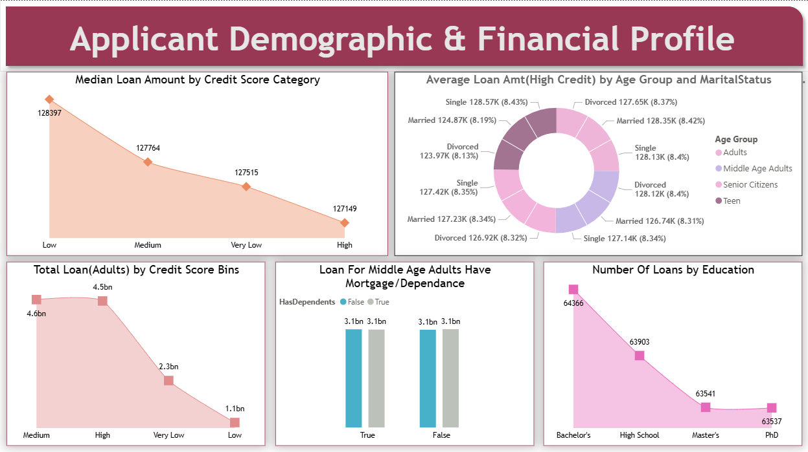
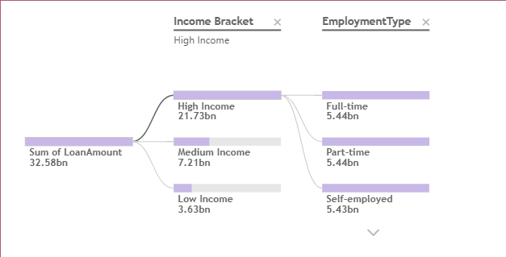
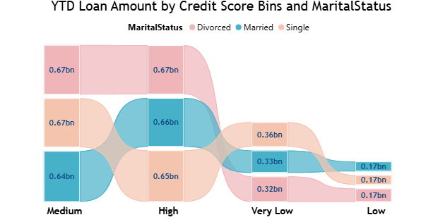

# 💳 Loan Default Analysis | End-to-End Power BI Solution  

🚀 Project Completed: Loan Default Analysis | Power BI Dashboard 🎉  
I’m excited to share my **end-to-end BI solution** where I analyzed loan default risks, applicant profiles, and financial trends.  

---

## 🔎 Project Overview  
The goal of this project was to help financial institutions **identify risk patterns** and **understand borrower behavior**.  

Key objectives:  
- 📊 Visualized **loan default trends** across time and regions  
- 👤 Analyzed **borrower demographics & financial profiles**  
- 🏦 Built a **Financial Risk Matrix** to assess default probabilities  
- 📈 Created **interactive dashboards** for decision-makers  

---

## 🛠️ Tools & Technologies Used  
- **Microsoft SQL Server** → Data ingestion & preprocessing (250,000+ records)  
- **Excel** → Initial validation and dataset checks  
- **Power Query Editor** → ETL, cleaning, and shaping  
- **Power BI Desktop** → Dashboard design and measures  
- **Power BI Service** → Dataflows, publishing, and refresh scheduling  
- **DAX (Data Analysis Expressions)** → KPIs, risk calculations, custom metrics  
- **Standard Mode Gateway** → Secure data connectivity  

---

## 📊 Visualizations in Report  
- 📈 **Line Charts** – Loan trends over time  
- 🧩 **Decomposition Tree** – Drill down into key risk drivers  
- 🎗 **Ribbon Chart** – Ranking shifts in loan categories  
- 📉 **Area Charts** – Default % over time  
- 🍩 **Donut Charts** – Loan type and repayment distribution  
- 📋 **Tables & Cards** – KPI snapshots (Total Loans, Default %, Risk Scores)  

---

## ✨ Dashboard Highlights  
- 📂 Built on a **large, complex dataset** (250K+ entries)  
- 🔎 Provided **multiple perspectives**: borrower, financial institution, regional trends  
- 🧮 Advanced filtering powered by **ALLEXCEPT & CALCULATE** in DAX  
- ⏰ **Scheduled & incremental refreshes** for near real-time reporting  
- 📊 Designed for **C-level executives & analysts** to track financial health  

---

## 📌 Dashboard Preview  

### 1️⃣ Loan Default Overview  
  

### 2️⃣ Financial Profile Analysis  
  

### 3️⃣ Decomposition Tree  
  

### 4️⃣ Ribbon Chart   
  

---

## 🧮 Key DAX Functions Used  
- **CALCULATE** → Contextual loan KPIs  
- **ALLEXCEPT** → Custom filtering for borrower segmentation  
- **IF / BLANK** → Handling missing loan attributes  
- **RANKX** → Ranking loan categories in Ribbon Charts  
- **AVERAGE / SUMX** → Risk scoring metrics  
- **DATE functions (YEAR, MONTH)** → Trend breakdowns  

---

## 📈 Outcomes Achieved  
1. **Clear visibility** into loan defaults by category, borrower profile, and time  
2. **Financial risk segmentation** for high-risk vs. low-risk applicants  
3. **Interactive insights** to support lending strategies  
4. **Optimized reporting** with automated refresh & scalable dataset  

---

## 🚀 Future Enhancements  
- 🔮 Predictive modeling for loan default forecasting (ML integration)  
- 🌍 Geo-mapping for regional loan risk heatmaps  
- ⚡ Integration with **Azure Synapse / Databricks** for advanced analytics  

---

## 📬 Contact  
👤 **gmule014-dotcom**  
📧 gmule014@gmail.com  
🔗 [GitHub Repository](https://github.com/gmule014-dotcom/Loan-Default-Analysis)  

---

## 🙌 Acknowledgments  
- Microsoft SQL Server  
- Power BI Community  
- SQLBI for advanced DAX references  

---

✨ This project has been a fantastic learning experience, helping me strengthen my **data analysis, visualization, and storytelling skills** with Power BI.  
