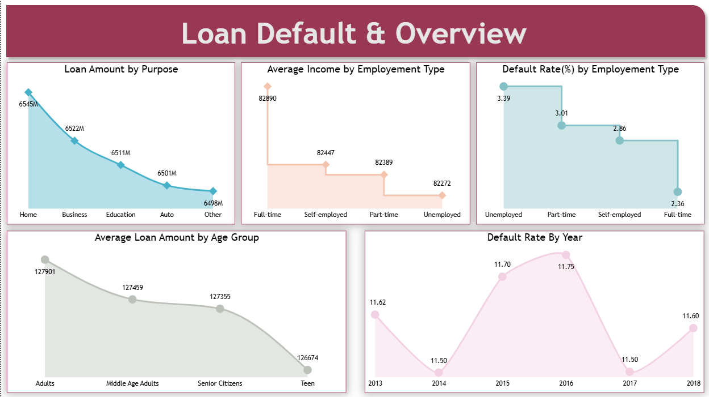
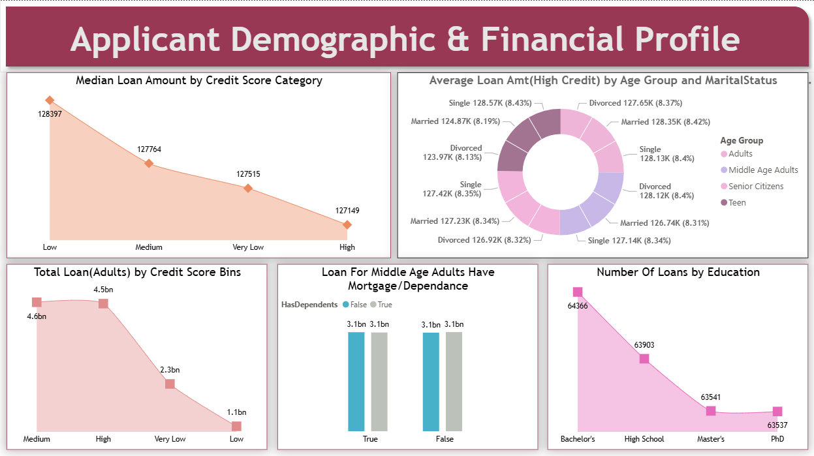
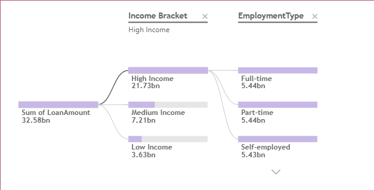
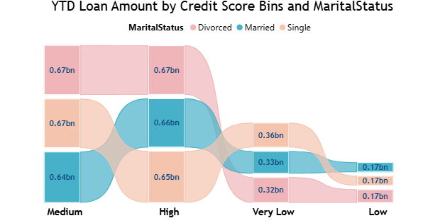

# 🚀 Project Completed: ElectroHub Store Data Analysis | End-to-End Power BI Solution  

I’m excited to announce the successful completion of my end-to-end **Power BI project: ElectroHub Store Analysis!** 🎉  

---

## 🔎 Project Overview
• Built an interactive dashboard to analyze **store sales performance** and provide a comprehensive overview 🛒  
• Explored **regional sales trends** with map visuals 🌍  
• Delivered insights into **product categories, customer behavior, and profitability** 📊  
• Developed KPIs for revenue, profit, growth, and store-level performance ⚡  

---

## 🛠️ Tools & Technologies Used
• **Microsoft SQL Server** → Source data cleaning & validation ✅  
• **Power Query Editor** → Data shaping, transformation, and standardization 🔄  
• **Power BI Desktop** → Report building & interactive dashboards 🖥️  
• **Power BI Service** → Cloud publishing & sharing ☁️  
• **DAX (Data Analysis Expressions)** → Advanced calculations & KPIs 📈  
• **Star Schema Modeling** → Optimized data model for faster reporting 📐  

---

## 📊 Visualizations
The dashboard leverages multiple visuals across **different report pages**:  
- Line charts → **Sales & Profit Trends Over Time** ⏳  
- Map visuals → **Geographical sales distribution** 🌍  
- Bar/Column charts → **Top & Bottom performing products & stores** 📦  
- Donut & Pie charts → **Category contribution to sales & profit margins** 🍩  
- Tables & Cards → **Quick KPI overviews & drill-through analysis** 🔍  
- Interactive Slicers → **Dynamic filtering by region, category, and store** 🎛️  

---

## ✨ Dashboard Highlights
• **Store-Level Insights**: Compare sales & profit across regions and locations  
• **Product Category Breakdown**: Identify top-selling and underperforming products  
• **Customer Insights**: Returning vs. new customer trends 👥  
• **Profitability Tracking**: Margin analysis with discount vs. profit impact 💰  
• **Dynamic Trends**: Drill down from yearly to monthly & daily sales performance  
• **Forecasting Ready**: Basis for demand prediction and seasonal analysis 📆  

---

## 📸 Dashboard Preview  

The **Loan Default Analysis** dashboard is structured across multiple pages, each providing unique insights into customer risk, financial performance, and loan default patterns. Below is a preview of the key report pages:  

---

### 🔹 1. Loan Default Overview  
👉 A high-level summary of loan disbursement, repayment status, and overall default trends.  
  

---

### 🔹 2. Financial Profile Analysis  
👉 Deep dive into borrower demographics, income levels, debt-to-income ratios, and financial risk assessment.  
  

---

### 🔹 3. Decomposition Tree  
👉 An interactive breakdown that allows drilling into **why defaults occur** by exploring attributes such as region, age group, loan type, and income band.  
  

---

### 🔹 4. Ribbon Chart (Loan Status Trends)  
👉 Visualizing the **shifts in loan status rankings over time**, highlighting which categories dominate defaults in different periods.  
  

---

✨ Together, these pages empower decision-makers with **clear visibility into borrower behavior, risk factors, and evolving loan performance trends**. 

## 📐 Core DAX Functions Used
- `SUM()` → Total Sales & Profit  
- `AVERAGE()` → Average Discount & Price  
- `COUNT()` → Transaction & Customer Counts  
- `DIVIDE()` → Safe percentage/profit calculations  
- `CALCULATE()` → Context-based measures  
- `RELATED()` → Bringing attributes across tables  
- `RANKX()` → Ranking stores/products by KPIs  

---

## 🛤 Roadmap
🔹 Add **AI-driven forecasting** for sales & customer churn prediction  
🔹 Deploy on **Power BI Service** with scheduled refresh ⏰  
🔹 Create **mobile-optimized dashboard version** 📱  
🔹 Expand analysis to include **inventory & supply chain metrics**  

---

## 📬 Contact
**gmule014-dotcom**  
📧 gmule014@gmail.com  
🔗 GitHub Repo: [ElectroHub Store Analysis](https://github.com/gmule014-dotcom/ElectroHub-Store-Analysis)  

---

## 🙏 Acknowledgments
- [Power BI Community](https://community.powerbi.com)  

---

✨ This project has been a fantastic learning experience, helping me strengthen my **data analysis, visualization, and storytelling skills** with Power BI.  
